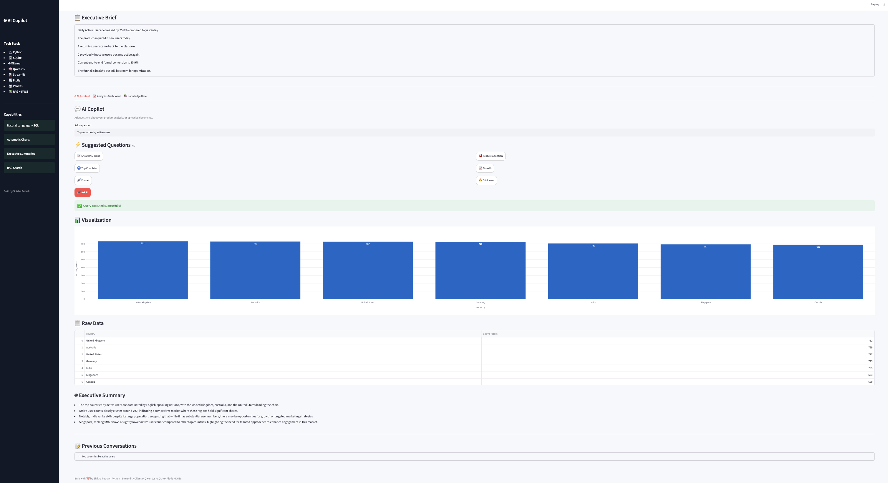

# 🤖 AI Product Analytics Copilot


An AI-powered Product Analytics Assistant that allows users to ask natural language questions about product data and documentation.

The application automatically generates SQL, queries a product analytics database, visualizes insights, generates executive summaries, and answers documentation questions using Retrieval-Augmented Generation (RAG).

---

## 📸 Application Preview

### Dashboard



### AI Assistant


### Analytics Dashboard


### Knowledge Base


## 🚀 Features

### 🤖 Natural Language → SQL

Ask questions like:

- Show DAU trend
- Top countries by active users
- Show feature adoption
- Compare WAU vs MAU

The assistant automatically generates SQL and queries the analytics database.

---

### 📊 Product Analytics Dashboard

Includes:

- Daily Active Users
- Weekly Active Users
- Monthly Active Users
- Feature Adoption
- Product Funnel
- Growth Accounting
- Stickiness Metrics

---

### 📈 Automatic Visualizations

Charts are generated automatically based on the returned query.

---

### 🤖 AI Executive Summaries

Every analytics query is summarized into an executive-friendly business insight using a local LLM.

---

### 📚 Retrieval-Augmented Generation (RAG)

Upload product documentation and ask:

- What does this document teach?
- Explain window functions.
- Summarize this PRD.

The assistant retrieves relevant chunks before generating an answer.

---

## 🛠 Tech Stack

- Python
- Streamlit
- SQLite
- Pandas
- Plotly
- Ollama
- Qwen 2.5
- Sentence Transformers
- FAISS

---

## 🏗 Architecture

```text
User Question
       │
       ▼
 AI Router
 ├───────────────┐
 │               │
 ▼               ▼
SQL Engine     RAG Engine
 │               │
 ▼               ▼
SQLite DB      PDFs
 │               │
 └──────┬────────┘
        ▼
 Local LLM (Qwen)
        ▼
 Executive Summary
        ▼
 Streamlit Dashboard
```

---

## 📂 Project Structure

```text
app/
├── ai/
├── analytics/
├── insights/
├── rag/
├── ui/
├── utils/

docs/
tests/
data/
```

---

## ▶️ Run Locally

```bash
git clone <repo>

cd ai-product-analytics-copilot

python -m venv .venv

source .venv/bin/activate

pip install -r requirements.txt

python -m streamlit run app/ui/dashboard.py
```

---

## 🔮 Future Improvements

- Authentication
- Multi-user support
- Cloud database integration
- LLM model selection
- Real-time analytics
- Scheduled executive reports

---

## 👩‍💻 Author

**Shikha Pathak**

Analytics Consultant | Product Analytics | AI Applications