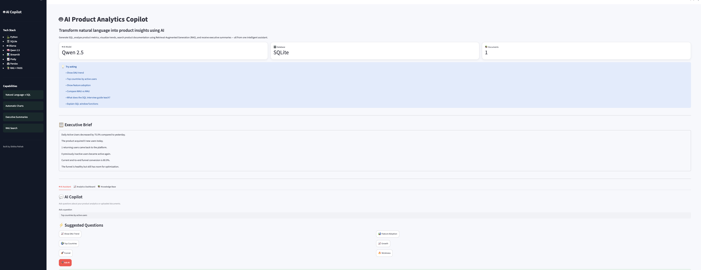
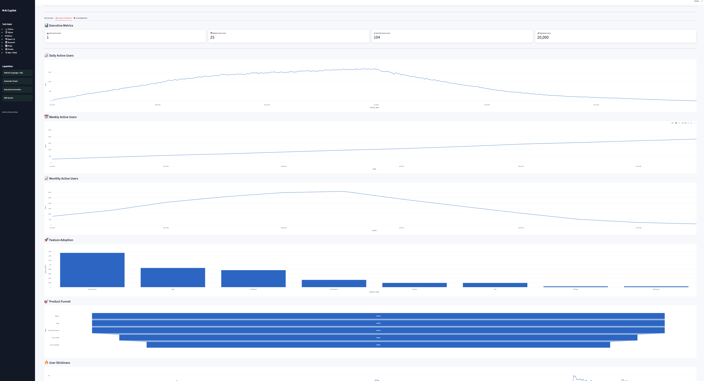
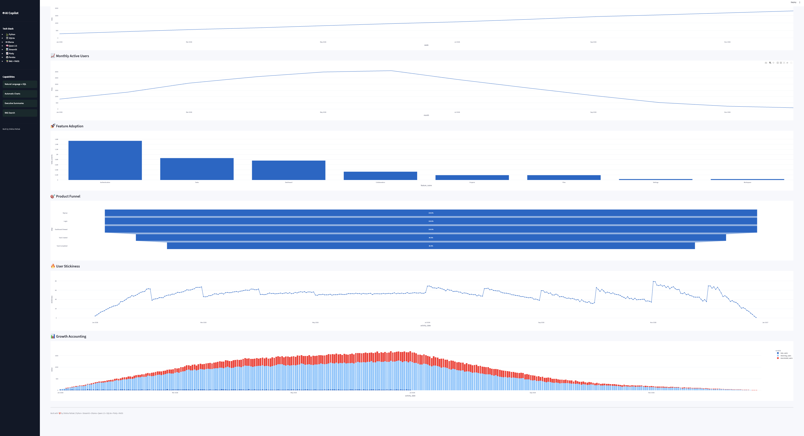
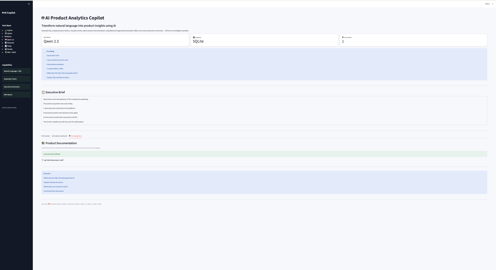

# 🤖 AI Product Analytics Copilot


An AI-powered Product Analytics Assistant that enables Product Managers, Data Analysts, and Business Teams to explore product data using natural language.

The application translates user questions into SQL, queries a product analytics database, generates interactive dashboards, summarizes insights using a local Large Language Model (LLM), and answers product documentation questions through Retrieval-Augmented Generation (RAG).

### Key Capabilities

- 🤖 Natural Language → SQL
- 📊 Product Analytics Dashboard
- 📈 Executive Insight Generation
- 📚 RAG-powered Knowledge Base
- 🧠 Local LLM (Qwen 2.5 via Ollama)
- ⚡ Interactive Streamlit Application

---

## 📸 Screenshots

### Dashboard


### AI Assistant



### Product Analytics Dashboard



### Product Metrics Dashboard



### Knowledge Base



## 🎥 Demo

> Demo video coming soon.

The application supports end-to-end product analytics workflows:

- Ask business questions in natural language
- Automatically generate SQL
- Query the analytics database
- Visualize KPIs
- Generate executive summaries
- Search product documentation using RAG

## 🚀 Features

### 🤖 Natural Language → SQL

Ask questions like:

- Show DAU trend
- Top countries by active users
- Show feature adoption
- Compare WAU vs MAU

The assistant automatically generates SQL and queries the analytics database.

---

### 📊 Product Analytics Dashboard

Includes:

- Daily Active Users
- Weekly Active Users
- Monthly Active Users
- Feature Adoption
- Product Funnel
- Growth Accounting
- Stickiness Metrics

---

### 📈 Automatic Visualizations

Charts are generated automatically based on the returned query.

---

### 🤖 AI Executive Summaries

Every analytics query is summarized into an executive-friendly business insight using a local LLM.

---

### 📚 Retrieval-Augmented Generation (RAG)

Upload product documentation and ask:

- What does this document teach?
- Explain window functions.
- Summarize this PRD.

The assistant retrieves relevant chunks before generating an answer.

---

## 💡 Example Questions

The assistant can answer questions such as:

- What is today's DAU?
- Show WAU vs MAU over time.
- Which feature has the highest adoption?
- Which countries have the most active users?
- Explain user stickiness.
- Summarize this Product Requirement Document.
- Explain the checkout feature documentation.
- Show monthly growth accounting.
- What is the activation rate?
- Generate an executive summary for this dashboard.


## 🛠 Tech Stack

### Frontend

- Streamlit

### Backend

- Python

### Database

- SQLite

### Data Processing

- Pandas

### Visualization

- Plotly

### AI / LLM

- Ollama
- Qwen 2.5

### Retrieval-Augmented Generation

- FAISS
- Sentence Transformers

### Version Control

- Git

---

## 🏗 Architecture

```text
User Question
       │
       ▼
 AI Router
 ├───────────────┐
 │               │
 ▼               ▼
SQL Engine     RAG Engine
 │               │
 ▼               ▼
SQLite DB      PDFs
 │               │
 └──────┬────────┘
        ▼
 Local LLM (Qwen)
        ▼
 Executive Summary
        ▼
 Streamlit Dashboard
```

---

## 🔄 Workflow

1. User asks a business question.
2. The application identifies whether the request requires SQL or document retrieval.
3. SQL queries are generated automatically using the LLM.
4. SQLite executes the query.
5. Results are visualized as interactive charts.
6. The LLM generates an executive-friendly business summary.
7. Documentation queries are answered using the RAG pipeline.


## 📂 Project Structure

```text
app/
├── ai/
│   ├── sql_generator.py
│   ├── executive_summary.py
│
├── analytics/
│   ├── metrics.py
│
├── rag/
│   ├── ingest.py
│   ├── retriever.py
│
├── ui/
│   └── dashboard.py
│
├── utils/
│   └── database.py

data/
docs/
tests/
requirements.txt
README.md
```

---

## ▶️ Run Locally

```bash
git clone <repo>

cd ai-product-analytics-copilot

python -m venv .venv

source .venv/bin/activate

pip install -r requirements.txt

python -m streamlit run app/ui/dashboard.py
```

---

## 🔮 Future Improvements

- Authentication
- Multi-user support
- Cloud database integration
- LLM model selection
- Real-time analytics
- Scheduled executive reports

---

## ⭐ Skills Demonstrated

- Product Analytics
- SQL Generation using LLMs
- Retrieval-Augmented Generation (RAG)
- Dashboard Development
- Data Visualization
- Business Intelligence
- Prompt Engineering
- SQLite
- Python
- Streamlit
- AI Applications

## 👋 About the Author

**Shikha Pathak**

Analytics Consultant with 5+ years of experience in Product Analytics, SQL, and Business Intelligence, currently building AI-powered analytics applications that combine LLMs with modern data workflows.

